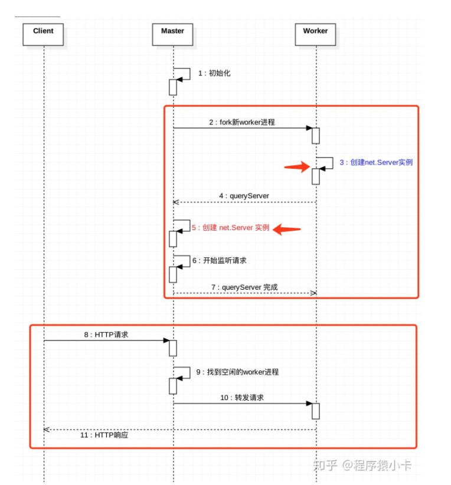

#### 参考文章
1. https://zhuanlan.zhihu.com/p/157987519
2. https://segmentfault.com/a/1190000021230376  
这篇文章基本上都是从上面几篇文章copy的，大家可以直接点开上面的链接查看

#### 原理
由一个主进程(master)以及若干个子进程(worker)构成。
由master监听客户端连接请求，并根据特定的策略，转发给worker（意味着只占用一个端口）。

#### master、worker如何通信
master进程通过cluster.fork()来创建worker进程。
cluster.fork()内部是通过child_process.fork()来创建子进程。

也就是说：
1. master进程、worker进程是父、子进程的关系。
2. master进程、woker进程可以通过IPC通道进行通信。（重要）

#### 如何实现端口共享
net模块中，对 listen() 方法进行了特殊处理。根据当前进程是master进程，还是worker进程：
1. master进程：在该端口上正常监听请求。（没做特殊处理）
2. worker进程：创建server实例。然后通过IPC通道，向master进程发送消息，让master进程也创建 server 实例，并在该端口上监听请求。当请求进来时，master进程将请求转发给worker进程的server实例。

归纳起来，就是：master进程监听特定端口，并将客户请求转发给worker进程。

#### 如何将请求分发到多个worker
每当worker进程创建server实例来监听请求，都会通过IPC通道，在master上进行注册。当客户端请求到达，master会负责将请求转发给对应的worker。

具体转发给哪个worker？这是由转发策略决定的。可以通过环境变量NODE_CLUSTER_SCHED_POLICY设置，也可以在cluster.setupMaster(options)时传入。

默认的转发策略是轮询（SCHED_RR）。

当有客户请求到达，master会轮询一遍worker列表，找到第一个空闲的worker，然后将该请求转发给该worker。

#### master挂了怎么办
